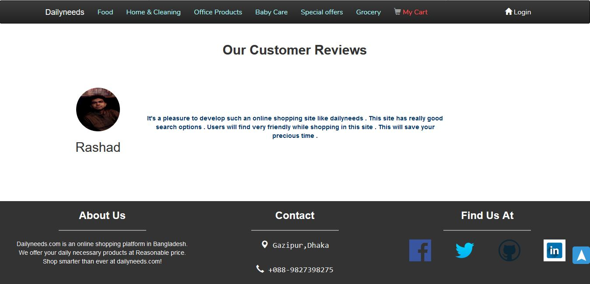

<h1 align="center">Dailyneeds - An Ecommerce Website</h1>

<b>Description :- </b>

This website has detailed information about different categorized products . People can see the products name as well as their descriptive information. Every user has to be registered to buy products . Customers will get cart system in this website so that they can select multiple products at a time and can order them. This website has an improved product search bar to search product by inserting them or by selecting them as category . Customers can search products by giving a price range . Customer can also give feedback about our products . Customers can see their shopping history in their profile . This website maintains a very good user interface . This website has ajax search bar . This website also has imgae magnifier feature . 

 

**How To Run This Project**

<b> Step - 1 :- </b> Create a database named needy in your phpmyadmin and then in that database import a file named needy.sql which is given here . 

<b> Step -2 :- </b> Now run the index.html file which is provided here and hopefully you will see the index page . 

<b> Step -3 :- </b> Now you can search products , add the products to the cart , buy products . 

 

<h3 align="center">Project Screenshots</h1>

  
  
  

  
