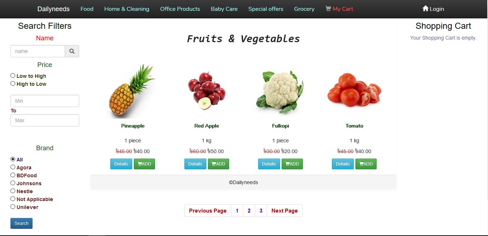

<h1 align="center">Forum Discussion Application</h1>

## Description

<p>It's an application where people can create discussions on various topics in which they face problems . For each discussion there is comment section where people can share their thoughts on that particular discussion . Only registered users can create discussion and comment . People can like or dislike a particular comment . Among those comments the creator of that discussion can select the best comment and then the comment section will turn off . Users also have points . By default an user will get 20 points , for each comment user will get 10 points , if a particular user's comment is selected as best answer that user will get 200 points . There are also filter systems in these application . Open discussions , close discussions , channels can be filtered out . There are also many more features in this application . </p>
<br>

## How To Run This Project

<p><b> Step - 1 :- </b> Download or clone this project from this repository . </p>

<p><b> Step - 2 :- </b> Create a database named forum in your phpmyadmin .</p>

<p><b> Step - 3 :- </b> Go to your directory where your downloaded or cloned project is located . Open your terminal . Now run this command :- </p>

```
php artisan serve
```
Now copy that localhost link and paste it in your browser .

<p><b> Step - 4 :- </b> Run this command in your terminal :-  </p>

```
php artisan migrate:refresh 
```

<p><b> Step - 5 :- </b> Then run this command in your terminal :- </p>

```
php artisan db:seed
```

<p><b> Step - 6 :- </b> Now to access the administrator account log in with password "admin" and email "admin@rash.com" </p>
<br>


<h2 align="center">Project Screenshots</h2>

<p align="center">
  
  
</p>

<p align="center">
  
  
</p>  
